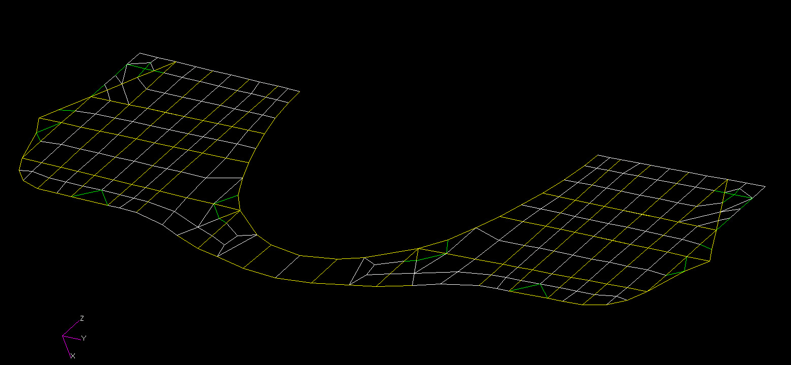

# ========================================
# Thermal Analysis of AV Bulkhead Model Derived From FEM Loads Model:
# ========================================

## Thermal Analysis of Air Vehicle Bulkhead Model using SindaG, Derived From FEM Loads Model with BDFUTIL Tool Prior to Reducing Thermal Model Complexity with CGSMIN Utility.

##
## I. AV Bulkhead FEM First Converted to Thermal System Model with BDFUTIL Tool Prior to Reducing Thermal Model Complexity with CGSMIN Utility:

##
## II. Thermal Analysis Executable: "./bin/modelBKHD496r3.exe"

##
## III. Thermal Analysis Input Files:
### III.a. "./input/modelBKHD496r3.SIN"
### III.b. "./input/modelBKHD496r3.for"
### III.c. "./input/modelBKHD496r3.ini"
### III.d. "./input/modelBKHD496r3.lst"
### III.e. "./input/modelBKHD496r3.s02"
### III.f. "./input/modelBKHD496r3.s04"
### III.g. "./input/modelBKHD496r3.sls"
### III.h. "./input/modelBKHD496r3.sls"

##
## IV. Thermal Analysis Output Files:

### IV.a. "./output/nr0.sin"
### IV.b. "./output/RESULTS_BKHD496.DAT"
### IV.c. "./output/modelBKHD496r3.sot"
